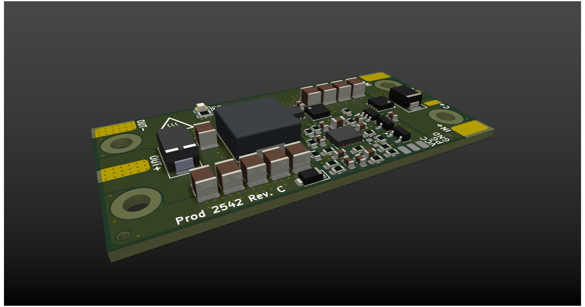
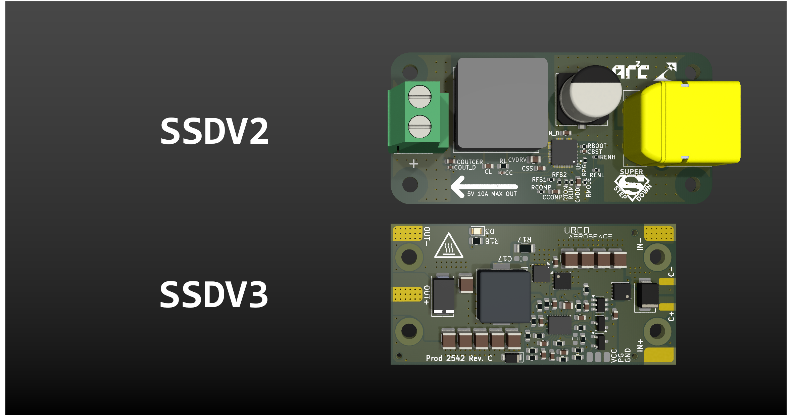

This project has been migrated to the UBCO Aerospace Club <a href="https://github.com/UBCOAerospaceClub/2025_SSDV3">2025_SSDV3</a> fork.

# The Super Step Down V3

The SSDV3 is an independently-made, non-isolated DC/DC converter designed for unmanned aerial systems (UAS). The module is intended for converting 50V battery input down to 5-12V output at a maximum load of 8A. It acts as a reliable battery-eliminator circuit (BEC) through effective regulation in the presence of voltage transients caused by high-power brushless motors.

## Specifications

<table><tbody>
  <tr>
    <td>Input Voltage</td>
    <td>20-60V</td>
  </tr>
  <tr>
    <td>Max Transient Voltage</td>
    <td>100V (clamping starts at 70V)</td>
  </tr>
  <tr>
    <td>Output Voltage(s)</td>
    <td>5.1V, 7.4V, 9.6V, 12V</td>
  </tr>
  <tr>
    <td>Thermal Max Output Current</td>
    <td>5A</td>
  </tr>
  <tr>
    <td>Designed Max Output Current</td>
    <td>8A</td>
  </tr>
  <tr>
    <td>Lowest Typical Efficiency</td>
    <td>89%</td>
  </tr>
  <tr>
    <td>Est. Voltage Overshoot</td>
    <td>200mV</td>
  </tr>
</tbody>
</table>

*Specifications are from design, not tested.*

## Comparison with Last Super Step Down

This design is motivated by the challenges encountered by the [UBCO Aerospace Club](https://github.com/UBCOAerospaceClub) with their Jellyfish quadcopter when powering auxiliary electronics off the drone's main battery. Lessons were learned through a variety of integration failures, investigations, and validation testing, and these experiences informed the development of version 3 of the Super Step Down series.

**Improvements from the previous version:**

- Dramatically improved regulation during line transients
- Considerable footprint area reduction by 16.5%
- Configurable output voltages instead of a fixed 5V output
- Added ESD protection on inputs
- Reverse polarity protection for the majority of the circuit
- Lower losses by using direct wire solder pads instead of terminal block

## Copyright Notice

Copyright &#169; Julian Joaquin 2025

Hardware Source Licensed under CERN-OHL-W version 2
