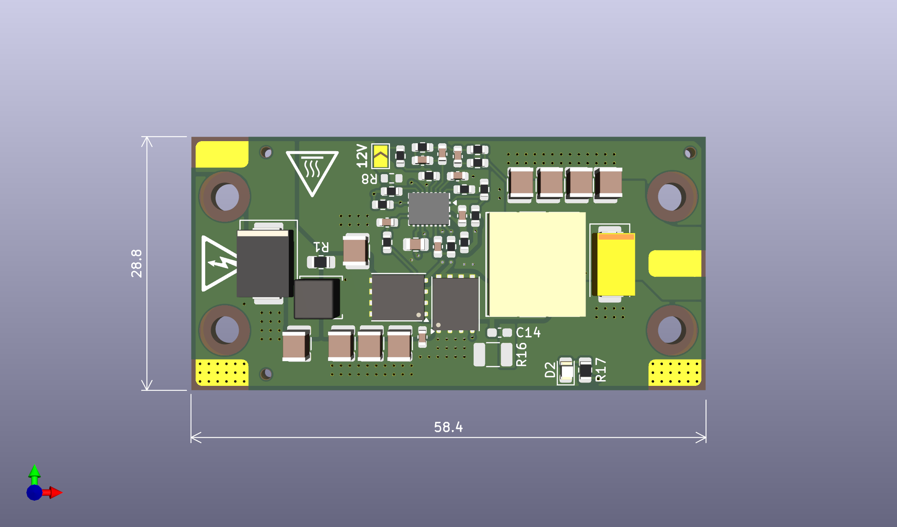

# The Super Step Down Prototype 3 Alteration 2

-----

The SSDP3A2 is an independently-made, non-isolated step-down module designed for the UBCO Aerospace Club. The module is intended for converting 50V battery input down to 5-12V output at a max load of 8A, and addresses the issues of its predecessor module from 2024.

## Specifications

<table><tbody>
  <tr>
    <td>Input Voltage</td>
    <td>20-70V</td>
  </tr>
  <tr>
    <td>Output Voltage</td>
    <td>5V, 12V</td>
  </tr>
  <tr>
    <td>Output Current</td>
    <td>8A</td>
  </tr>
  <tr>
    <td>Efficiency</td>
    <td>89%</td>
  </tr>
  <tr>
    <td>Est. Voltage Overshoot</td>
    <td>200mV</td>
  </tr>
</tbody>
</table>

*Specifications are from design, not tested.*

## Comparison with Last Super Step Down

